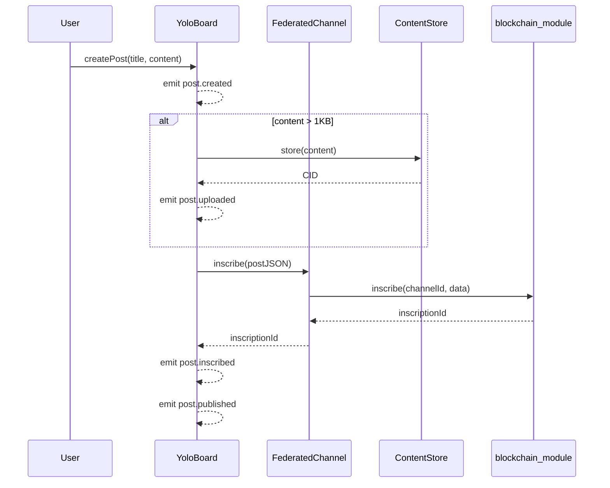

# YOLO — Censorship-Resistant Community Board

[](https://github.com/jimmy-claw/logos-yolo/actions/workflows/ci.yml)
[](https://github.com/jimmy-claw/logos-yolo/releases/latest)

YOLO is a community board module for the [Logos](https://logos.co) network. It lets anyone create boards, post content, and read from multiple writers — all backed by on-chain inscriptions and content-addressed storage. Posts are published through federated channels where each admin writes to their own blockchain channel, and readers see a merged chronological feed. There is no central server, no moderation API, and no single point of failure. Built as a demo for the ETHCluj workshop.

## Architecture

```
┌─────────────────────────────────────────────────────┐
│                      User (QML UI / CLI)            │
└──────────────────────┬──────────────────────────────┘
                       │
                 ┌─────▼─────┐
                 │   Yolo    │  High-level API (Q_INVOKABLE)
                 └─────┬─────┘
                       │
                ┌──────▼──────┐
                │  YoloBoard  │  Board logic, post lifecycle
                └──┬───┬───┬──┘
                   │   │   │
        ┌──────────┘   │   └──────────┐
        ▼              ▼              ▼
┌───────────────┐ ┌──────────┐ ┌──────────────┐
│ Federated     │ │ Content  │ │ Channel      │
│ Channel       │ │ Store    │ │ Indexer      │
│               │ │          │ │              │
│ Multi-writer  │ │ CID-based│ │ Discovery +  │
│ inscriptions  │ │ storage  │ │ history      │
└───────┬───────┘ └────┬─────┘ └──────┬───────┘
        │              │              │
        ▼              ▼              ▼
  blockchain_module  storage_module  kv_module
  (Logos Core)       (Logos Core)    (Logos Core)
```

**Data flow for a post:**



## Quick Start

### Prerequisites

- CMake 3.16+
- Qt6 (Core, Qml, Test; plus Widgets, Quick, QuickWidgets for UI)
- C++17 compiler
- [logos-pipe](https://github.com/jimmy-claw/logos-pipe) (branch `feature/federated-channel`)

### Build & Run Tests

```bash
# Clone both repos
git clone https://github.com/jimmy-claw/logos-yolo.git
git clone -b feature/federated-channel https://github.com/jimmy-claw/logos-pipe.git

# Build tests
cd logos-yolo
cmake -B build -DBUILD_TESTS=ON -DLOGOS_PIPE_ROOT=../logos-pipe
cmake --build build -j$(nproc)

# Run tests
ctest --output-on-failure --test-dir build
```

### Build UI Plugin (for logos-app)

```bash
cmake -B build-ui -DBUILD_UI_PLUGIN=ON \
  -DLOGOS_PIPE_ROOT=../logos-pipe \
  -DLOGOS_CPP_SDK_ROOT=/path/to/logos-cpp-sdk \
  -DLOGOS_LIBLOGOS_ROOT=/path/to/logos-liblogos
cmake --build build-ui --target yolo_ui -j$(nproc)
```

### Build Headless Module (for logoscore)

```bash
cmake -B build-module -DBUILD_MODULE=ON \
  -DLOGOS_CPP_SDK_ROOT=/path/to/logos-cpp-sdk \
  -DLOGOS_LIBLOGOS_ROOT=/path/to/logos-liblogos
cmake --build build-module --target yolo_plugin -j$(nproc)
```

### Nix Build

```bash
# Headless module
nix build --override-input logos-pipe-src ./path/to/logos-pipe -L

# UI plugin
nix build .#ui-plugin --override-input logos-pipe-src ./path/to/logos-pipe -L

# .lgx bundle (headless + UI + QML)
nix build .#lgx --override-input logos-pipe-src ./path/to/logos-pipe -L
```

### Load in Basecamp / logos-app

```bash
# Using Makefile targets (requires Nix store SDKs):
make install-all

# Manual:
mkdir -p ~/.local/share/Logos/LogosAppNix/modules/yolo
cp build-module/yolo_plugin.so ~/.local/share/Logos/LogosAppNix/modules/yolo/
cp metadata.json ~/.local/share/Logos/LogosAppNix/modules/yolo/manifest.json

mkdir -p ~/.local/share/Logos/LogosAppNix/plugins/yolo_ui
cp build-ui/libyolo_ui.so ~/.local/share/Logos/LogosAppNix/plugins/yolo_ui/yolo_ui.so
```

## API Reference

### YoloBoard

Core board logic. Manages posts, storage offload, and federation.

| Method | Description |
|--------|-------------|
| `createBoard(name, description)` | Create a new board with prefix `YOLO:<name>` |
| `joinBoard(boardId)` | Join an existing board by channel ID |
| `createPost(title, content, author)` | Publish a post. Large content (>1KB) auto-offloaded to ContentStore |
| `getPosts(limit=50)` | Read posts from all federated writers, newest first |
| `discoverBoards()` | Scan for all `YOLO:*` channels. Returns JSON array |
| `uploadContent(data)` | Store arbitrary data in ContentStore, returns CID |
| `downloadContent(cid)` | Fetch content by CID |
| `boardName()` | Current board name |
| `boardPrefix()` | Channel prefix (`YOLO:<name>`) |

**Client wiring (required before use):**

```cpp
board.setBlockchainClient(client);  // For FederatedChannel + ChannelIndexer
board.setStorageClient(client);     // For ContentStore
board.setKvClient(client);          // For ChannelIndexer persistence
board.setOwnPubkey(hexPubkey);      // For inscribing (admin identity)
```

### Yolo (QML Bridge)

High-level wrapper exposed to QML as context property `yolo`.

| Method | Description |
|--------|-------------|
| `discoverBoards()` | Returns `QVariantList` of boards for QML consumption |
| `selectBoard(name)` | Set active board |
| `createNewBoard(name, description)` | Create and select a board |
| `getPosts(limit=50)` | Returns `QVariantList` of posts |
| `submitPost(title, content)` | Create post on active board, returns post ID |
| `hello()` | Health check / greeting |

### YoloPlugin (logoscore)

Headless plugin loaded by `logos_host`.

| Method | Description |
|--------|-------------|
| `name()` | Returns `"yolo"` |
| `version()` | Returns `"0.1.0"` |
| `initLogos(api)` | Wire up Logos Core clients |
| `hello()` | Health check |

## Event Pipeline

All events are emitted via `eventResponse(eventName, [type, message])` during the post lifecycle:

| Event | Type | When | Message example |
|-------|------|------|-----------------|
| `post.created` | `info` | Post object constructed | `"Post created: My Title"` |
| `post.uploading` | `info` | Content > 1KB, starting upload | `"Uploading content to storage..."` |
| `post.uploaded` | `success` | ContentStore returned CID | `"Content stored: Qm..."` |
| `post.inscribing` | `info` | Writing to blockchain | `"Inscribing post on channel..."` |
| `post.inscribed` | `success` | Inscription confirmed | `"Post inscribed: <id>"` |
| `post.published` | `success` | Full pipeline complete | `"Post published: My Title"` |

Small posts (<=1KB) skip `post.uploading` and `post.uploaded`, producing 4 events.
Large posts (>1KB) produce all 6 events.

**Signal cascade:**

```
YoloBoard::eventResponse  →  Yolo::newEvent (QML)
                           →  Yolo::eventResponse (forwarded)
                                →  YoloPlugin::eventResponse (logoscore)
```

## Dependencies

| Dependency | Purpose | Required for |
|------------|---------|-------------|
| [logos-pipe](https://github.com/jimmy-claw/logos-pipe) (`feature/federated-channel`) | FederatedChannel, ContentStore, ChannelIndexer, ChannelSync | Tests, UI plugin (board support) |
| [logos-cpp-sdk](https://github.com/logos-co/logos-cpp-sdk) | LogosAPI, PluginInterface, LogosAPIClient | Headless module, UI plugin (Logos Core integration) |
| [logos-liblogos](https://github.com/logos-co/logos-liblogos) | Core runtime library | Headless module, UI plugin (Logos Core integration) |
| Qt6 Core, Qml | Base Qt types, QML engine | All builds |
| Qt6 RemoteObjects | IPC with Logos Core | Headless module |
| Qt6 Widgets, Quick, QuickWidgets | GUI rendering | UI plugin |
| Qt6 Test | Test framework | Tests only |

## Project Structure

```
logos-yolo-module/
├── src/
│   ├── yolo.h/.cpp                 # Yolo — high-level API and QML bridge
│   ├── yolo_board.h/.cpp           # YoloBoard — board logic, post lifecycle, federation
│   ├── yolo_plugin.h/.cpp          # YoloPlugin — headless logoscore plugin wrapper
│   └── yolo_ui_component.h/.cpp    # YoloUIComponent — IComponent UI plugin for logos-app
├── qml/
│   ├── MainView.qml                # Root layout: header, navigation stack, event log
│   ├── BoardList.qml               # Board discovery, creation, and selection
│   ├── BoardView.qml               # Post list with refresh and "new post" action
│   ├── CreatePost.qml              # Post composition form
│   ├── EventLog.qml                # Real-time event stream (dark theme panel)
│   └── yolo_ui.qrc                 # Qt resource file bundling QML
├── tests/
│   ├── test_yolo_board.cpp         # Unit tests: board CRUD, post serialization, discovery
│   ├── test_yolo_events.cpp        # Signal chain verification for post lifecycle
│   ├── test_yolo_federation.cpp    # Multi-admin federation, merged history
│   ├── test_yolo_event_lifecycle.cpp # End-to-end event sequence (6 events)
│   ├── test_integration.cpp        # Full flow: board → post → read → verify
│   └── logos_api_client.h          # LogosAPIClient stub for mock-based testing
├── interfaces/
│   └── IComponent.h                # logos-app plugin interface
├── examples/
│   ├── demo-post.sh                # Demo: create board, post messages, read back
│   ├── multi-admin-demo.sh         # Demo: two admins, merged feed
│   └── WALKTHROUGH.md              # Step-by-step guide for workshop
├── .github/workflows/ci.yml        # CI: CMake build+test, Nix headless, Nix UI
├── CMakeLists.txt                  # Build config (module, UI plugin, tests)
├── flake.nix                       # Nix flake (headless, UI, .lgx bundle)
├── Makefile                        # Convenience targets (build, install, nix helpers)
├── metadata.json                   # Headless plugin manifest
├── ui_metadata.json                # UI plugin manifest
└── module.yaml                     # Module descriptor
```

## ETHCluj Workshop Context

This module is a live demo for the **ETHCluj workshop** showing how to build censorship-resistant applications on Logos. The workshop walks through:

1. **The problem** — centralized platforms can censor, deplatform, or silently filter content
2. **The Logos approach** — on-chain inscriptions + federated channels = no single point of control
3. **Building YOLO** — a community board where:
   - Anyone can create a board (a named federated channel)
   - Multiple admins can post (each writes to their own sub-channel)
   - Readers see a merged, chronological feed from all admins
   - Large content is offloaded to content-addressed storage (CID references)
   - Every step of the pipeline emits observable events
4. **Hands-on** — participants build from source, run tests, post messages, and watch the event log

The QML UI provides a visual interface for the demo, but the same operations work headlessly through `logoscore` or programmatically via the C++ API.

## License

See repository root for license information.
